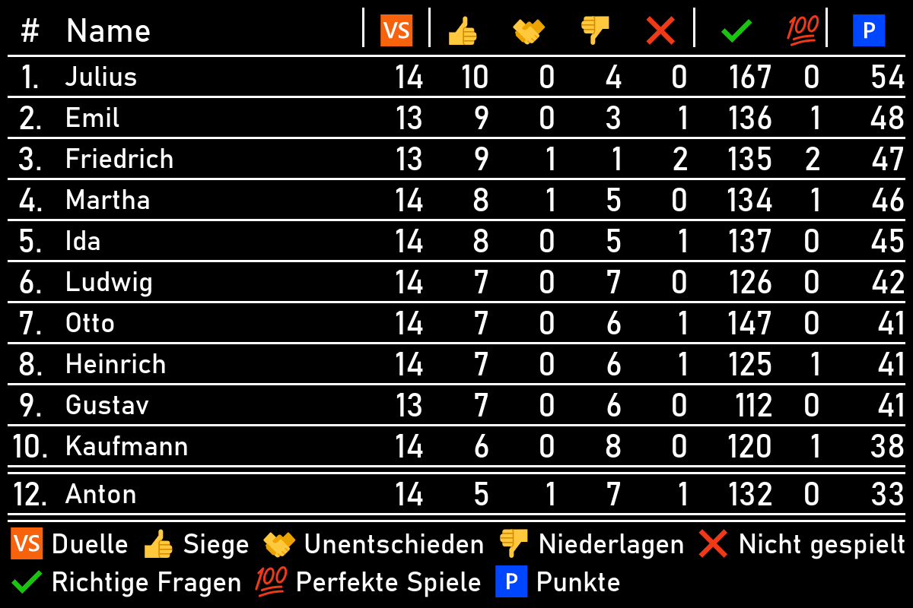

# MediaGenerator
Der MediaGenerator erzeugt Bilder für die QDLiga.\
Erzeugt werden können:
- [Statistik-Tabelle](#statistik-tabelle "Statistik-Tabelle")

---
### Statistik-Tabelle
Die Statistik-Tabelle beinhaltet die Top 10 der Gesamtstatistik sowie ggf. den Nutzer sofern sich dieser nicht in den Top 10 befindet.\
Das Bild ist für das Versenden per Telegram gedacht.

Die Felder `Duelle`, `Siege`, `Unentschieden`, `Niederlagen` und `Nicht gespielt` sind auf maximal 3-stellige Zahlen ausgelegt.\
Die Felder `Richtige Fragen` und `Punkte` sind auf maximal 4-stellige Zahlen ausgelegt.\
Das Feld `Perfekte Spiele` ist auf maximal 2-stellige Zahlen ausgelegt.\
Sollten diese Zahlen überschritten werden, muss die Feldbreite angepasst werdem.

Ein pixelgenauer Plan befindet sich in [Statistik_Tabelle.pdn](media/Statistik_Tabelle.pdn "Statistik_Tabelle.pdn")

---