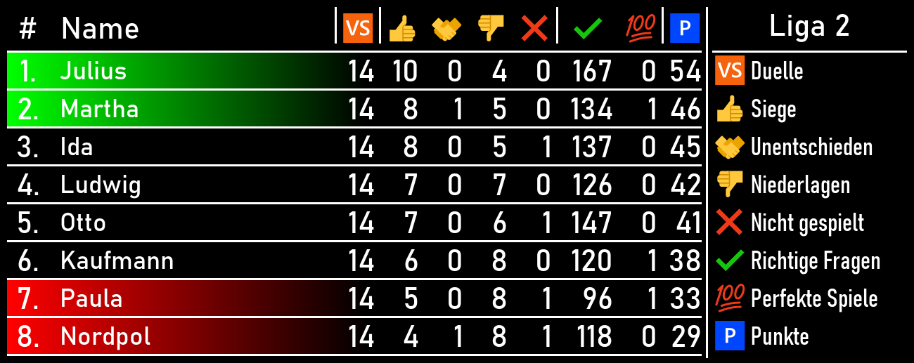
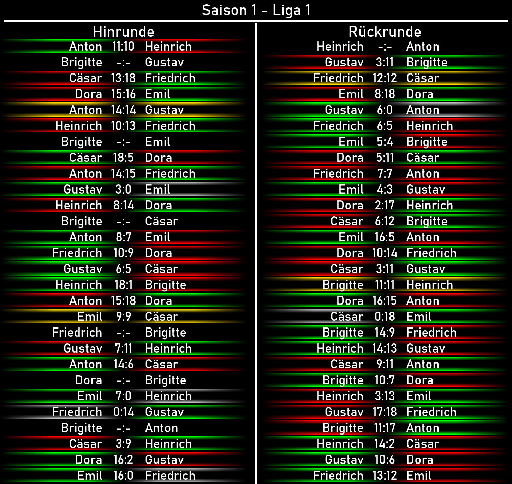

# MediaGenerator
Der MediaGenerator erzeugt Bilder für die QDLiga.\
Erzeugt werden können:
- [Liga-Tabelle](#liga-tabelle "Liga-Tabelle")
- [Statistik-Tabelle](#statistik-tabelle "Statistik-Tabelle")

---
### Liga-Tabelle
Die Liga-Tabelle beinhaltet den aktuellen Liga-Stand aller Spieler einer bestimmten Liga.\
Eingerechnet sind nur Abgeschlossene Spiele, die bereits bestätigt wurden.\
Das Bild ist für das Versenden per Telegram gedacht.

Die Hintergrundfarbe der einzelnen Einträge zeigt an ob sich ein Spieler auf einem Aufsteigs- (Grün) oder Absteigsrang (Rot) befindet oder er der Führende der 1. Liga ist (Gold).

Alle Felder bis auf `Richtige Fragen` sind auf maximal 2-stellige Zahlen ausgelegt.\
Das Feld `Richtige Fragen` ist auf maximal 3-stellige Zahlen ausgelegt.\
Diese Zahlen sind an die Maximalwerte der Liga mit 14 Spielen pro Spieler angepasst.\
Sollten Änderungen erfolgen muss die Feldbreite ggf. angepasst werden.

Ein pixelgenauer Plan befindet sich in [Liga_Tabelle.pdn](media/Liga_Tabelle.pdn "Liga_Tabelle.pdn")

---
### Statistik-Tabelle
Die Statistik-Tabelle beinhaltet die Top 10 der Gesamtstatistik sowie ggf. den Nutzer sofern sich dieser nicht in den Top 10 befindet.\
Das Bild ist für das Versenden per Telegram gedacht.

Die Felder `Duelle`, `Siege`, `Unentschieden`, `Niederlagen` und `Nicht gespielt` sind auf maximal 3-stellige Zahlen ausgelegt.\
Die Felder `Richtige Fragen` und `Punkte` sind auf maximal 4-stellige Zahlen ausgelegt.\
Das Feld `Perfekte Spiele` ist auf maximal 2-stellige Zahlen ausgelegt.\
Sollten diese Zahlen überschritten werden, muss die Feldbreite angepasst werden.

Ein pixelgenauer Plan befindet sich in [Statistik_Tabelle.pdn](media/Statistik_Tabelle.pdn "Statistik_Tabelle.pdn")

---
### Ergebnis-Liste
Die Ergebnis-Liste zeigt alle Spiele einer Liga (Hin- und Rückrunde). Das Ergebnis ist nur eingetragen, wenn es von beiden Spielern bestätigt wurde.

Ein pixelgenauer Plan befindet sich in [Liga_Ergebnisse.pdn](media/Liga_Ergebnisse.pdn "Liga_Ergebnisse.pdn")

---